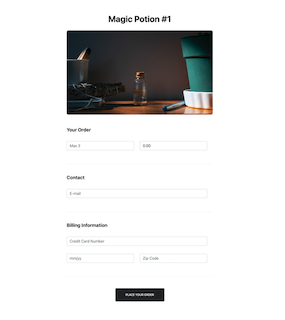
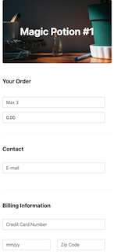

# Magic Potion Launch Site

This repository contains the Magic Potion launch site.  A landing page where the user may enter their information to place an order. Information is stored locally in memory and will not persist when application is refreshed/closed.

Built with React, React-Bootstrap, and Styled Components

## Setup
* Download/Clone repository. You will need `Node.js` installed.
* Run `npm install` from the project directory to install dependencies.

To start the application: 
`npm start`

To view the application:
`localhost:3000`

To run test suite: 
`npm test`

## Notes
* All business logic is located in `App.jsx`
* Stateless functional reusable components
* The form has very basic validation with the use of regex and length checking mainly to show UI interactions.  For production I would choose to use Formik to leverage validation capabilites.
  * Form validation: (on submit)
    * quantity - limited to entering 1-3
    * e-mail - regex xxx@xxx.com
    * credit card - 16 digits
    * expiration - regex (1-12)/xx
    * zip code - 5 digits
* Mock-API
  * should respond with status code 201 when successful and return an id
  * adds record to mock data
  * should respond with status code 422 if e-mail matches an existing record
    * test email: user@email.com
* Had some issues targeting elements for tests and had to mostly use `getByPlaceholderText`